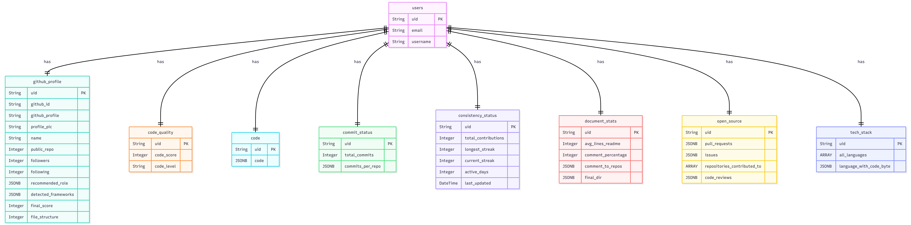

# DevLegacy

DevLegacy is an analysis tool that evaluates a developer's GitHub profile to generate a comprehensive legacy score. It assesses code quality, documentation habits, commit consistency, and file structures to provide a detailed developer profile and role recommendations.

## Features
- **Profile & Consistency Tracking:** Analyzes total commits, streaks, and active open-source contributions.
- **Code & Structure Evaluation:** Scores code quality using LLaMA models and evaluates repository directory structures.
- **Documentation Metrics:** Evaluates average README lengths and codebase comment percentages.
- **Role Recommendation:** Suggests appropriate user roles based on the detected tech stack and frameworks.
- **3D Interactive UI:** Provides an immersive experience using React Three Fiber.

## Tech Stack
- **Frontend:** React (Vite), Tailwind CSS, React Three Fiber (Three.js)
- **Backend:** FastAPI (Python), SQLAlchemy, PostgreSQL
- **AI/ML:** Hugging Face Hub, LLaMA CPP Python, PyTorch, Scikit-learn
- **Infrastructure:** Docker, Docker Compose, Ngrok, Firebase Admin

## How to Run

1. **Configure Environment:** Create `backend/.env` (using `backend/.env.example` as a template) and place your Firebase credentials at `backend/serviceAccountKey.json`.
2. **Start Backend & Database:**
   ```bash
   docker compose up --build -d
   ```
3. **Start Frontend:**
   ```bash
   cd frontend
   npm install
   npm run dev
   ```

## Notes
- To enable full analysis features, ensure both `hugging_face_token` and GitHub credentials are set properly in your `backend/.env` file.

## database

